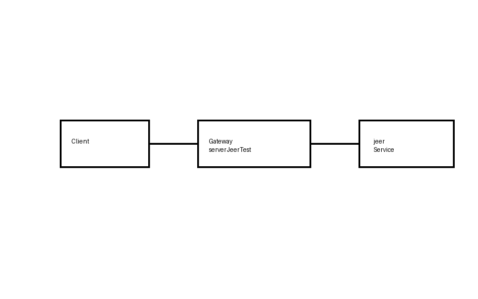

# Jolie Microservices Demo

This project demonstrates a simple microservice architecture built using the Jolie programming language.

## Architecture



The system consists of:
- **Client**
- **Gateway service (`serverJeerTest.ol`)**
- **Microservice (`jeer.ol`)**

The gateway receives requests and communicates with the microservice using Jolie interfaces.

## Project Structure

```
jolie-microservices-demo
│
├── services
│   ├── jeer.ol
│   └── serverJeerTest.ol
│
├── interfaces
│   └── Interface.iol
│
├── architecture
│   └── architecture.png
│
└── README.md
```

## Technologies

- Jolie
- Microservices
- Service-Oriented Architecture (SOA)

## How to Run

1. Install Jolie:
https://www.jolie-lang.org/

2. Start the gateway service:

```
jolie services/serverJeerTest.ol
```

3. Run the microservice:

```
jolie services/jeer.ol
```

## Purpose

This project was originally developed as a university assignment to demonstrate service-oriented microservice communication using Jolie.
